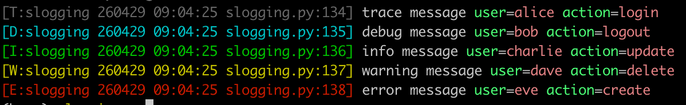

# dictlog

[English](README_EN.md)

受 [structlog](https://github.com/hynek/structlog) 启发的轻量级结构化日志库，提供彩色终端输出和上下文绑定。

相比 structlog，dictlog 的方法签名完全标注了类型，编辑器可以正常补全和提示。

功能肯定没有 structlog 强大，但是终于不用再看编辑器的错误提示了。

由于是基于系统库 logging 实现，使用上完全兼容。



## 特性

- 结构化日志 + key-value 上下文绑定（`bind`/`unbind`）
- 彩色终端输出，紧凑格式
- 支持 6 种日志级别：`TRACE` < `DEBUG` < `INFO` < `WARNING` < `ERROR` < `CRITICAL`
- 支持子 logger（用 `.` 分隔名称）
- `exception()` 方法自动附加异常堆栈；所有日志方法均支持 `exc_info`、`*args`（`%`-style 格式化）和 `stacklevel` 参数，与标准 `logging` 保持一致
- 开箱即用，零配置
- 完整的类型标注，编辑器友好

## 安装

```bash
pip install dictlog
# 或使用 uv
uv add dictlog
```

要求 Python >= 3.9。

## 使用

```python
import dictlog

# 基本用法
log = dictlog.get_logger("myapp")
# 调整日志级别，与 logging.DEBUG 等价，默认是 WARNING
log.level = dictlog.DEBUG

# 支持的日志级别：TRACE(5) < DEBUG(10) < INFO(20) < WARNING(30) < ERROR(40) < CRITICAL(50)
log.trace("detailed debug info", user_id=123)  # 最详细的调试信息
log.debug("debug message", port=8080)
log.info("server started", port=8080)

# % 风格格式化参数，与 logging 用法一致
log.info("hello %s", "world")
log.debug("x=%d y=%d", 1, 2)

# 自定义 stacklevel（默认 1，即直接调用方的帧）
def my_wrapper():
    log.info("from wrapper", stacklevel=2)  # 上报到调用 my_wrapper() 的代码行

# 绑定上下文，后续调用自动携带
log = log.bind(user="alice")
log.info("user logged in")          # 自带 user=alice
log = log.unbind("user")
log.info("context removed")         # 不再包含 user

# 捕获异常并附加堆栈，与 logging 用法一致
try:
    1 / 0
except ZeroDivisionError:
    log.error("something went wrong", exc_info=True)
    # 或使用 exception()，默认 exc_info=True
    log.exception("something went wrong")
```

## 输出到日志文件

dictlog 与 `logging.basicConfig` 完全兼容。通过 `basicConfig` 输出到文件时，日志内容为纯文本（包含 key-value 字段，但不包含颜色码）：

```python
import logging
import dictlog

# 配置输出到文件
logging.basicConfig(
    level=dictlog.INFO,
    filename="app.log",
    format="%(levelname)s - %(message)s"
)

log = dictlog.get_logger("myapp")
log.info("user logged in", user="alice", ip="192.168.1.1")
```

文件 `app.log` 中的内容：
```
INFO - user logged in user=alice ip=192.168.1.1
```

dictlog 会同时输出到文件（通过 `basicConfig`）和终端（带颜色）。如果只需要文件输出，可以禁用 dictlog 的默认 handler。

## dictlog 是如何调用 logging 的

```python
log = dictlog.get_logger("foo", name=123)
log.info("hello")
```

等价于

```python
root_log = logging.getLogger("dictlog")
if not root_log.handlers:
    handler = logging.StreamHandler()
    handler.setFormatter(_formatter)  # ColorFormatter
    root_log.addHandler(handler)
log = logging.getLogger("dictlog.foo")
log.info("hello %s", "name=123")
```

> 如果不想使用 `dictlog.` 开头，可以通过修改 `dictlog._ROOT_NAME` 实现


## 开发

```bash
# 安装依赖
uv sync

# 运行 pre-commit hooks
uv run pre-commit run --all-files

# 运行示例
uv run dictlog.py
```

## License

[MIT](LICENSE)
